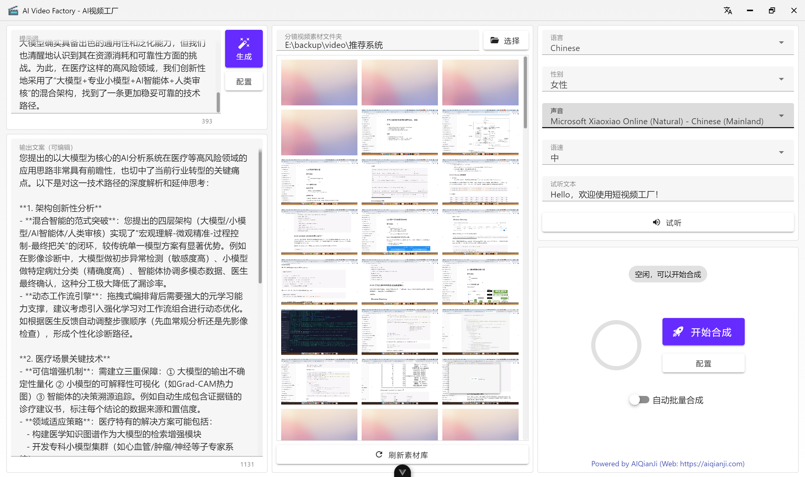

<!-- 项目海报 -->

  

---

<!-- 项目LOGO -->
 

  

<h3 align="center">AI Video Factory - 视频工厂</h3>

  

    🚀 一键生成产品营销与泛内容视频，AI批量自动剪辑，高颜值跨平台桌面端工具
  

  <!-- 项目徽章 -->

<!-- ![发布日期][release-date-shield] -->

  

    <a href="https://github.com/icodebase-cn/ai_video_factory/issues/new?labels=bug&template=bug-report---.md">报告Bug</a>
    &middot;
    <a href="https://github.com/icodebase-cn/ai_video_factory/issues/new?labels=enhancement&template=feature-request---.md">请求功能</a>
  

<!-- 关于项目 -->

## 📖 关于项目

短视频工厂是一个开源的桌面端应用，旨在通过AI技术简化短视频的制作流程。用户可以通过简单的提示词文本+视频分镜素材，快速且自动的剪辑出高质量的产品营销和泛内容短视频。该项目集成了AI驱动的文案生成、语音合成、视频剪辑、字幕特效等功能，旨在为用户提供开箱即用的短视频制作体验。

### 核心功能

- 🤖 **AI驱动**：集成了最新的AI技术，提升视频制作效率和质量
- 📝 **文案生成**：基于提示词生成高质量的短视频文案
- 🎥 **自动剪辑**：支持多种视频格式，自动化批量处理视频剪辑任务
- 🎙️ **语音合成**：将生成的文案转换为自然流畅的语音
- 🎬 **字幕特效**：自动添加字幕和特效，提升视频质量
- 📦 **批量处理**：支持批量任务，按预设自动持续合成视频
- 🌐 **多语言支持**：支持中文、英文等多种语言，满足不同用户需求
- 📦 **开箱即用**：无需复杂配置，用户可以快速上手
- 📈 **持续更新**：定期发布新版本，修复bug并添加新功能
- 🔒 **安全可靠**：完全本地本地化运行，确保用户数据安全
- 🎨 **用户友好**：简洁直观的用户界面，易于操作
- 💻 **多平台支持**：支持Windows、macOS和Linux等多个操作系统

(<a href="#readme-top">返回顶部</a>)

## 🚀 开始使用

前往 [官方文档](https://aiqianji.com/blog/topic/390) 查看使用手册

(<a href="#readme-top">返回顶部</a>)

## 🗺️ 路线图

**喜欢可以点个 Star 支持一下哦！**

下面是已实现和计划中的功能：

- [x] 文案生成，兼容通用的 OpenAI 接口格式
- [x] 语音合成，支持EdgeTTS
- [x] 视频剪辑，文案、视频、音频、字幕合成，自动混剪
- [x] 批量处理，支持一个批量任务，按预设自动持续合成视频
- [x] 多语言支持，能够支持中文、英文等多种语言
- [x] 完善的使用手册
- [ ] 更全面的参数调整
- [ ] 更多的语音合成API
- [ ] 字幕特效，支持多种字幕样式和特效

查看[开放问题](https://github.com/icodebase-cn/ai_video_factory/issues)以获取提议功能（和已知问题）的完整列表。

(<a href="#readme-top">返回顶部</a>)

## 🎞️ 示例视频

<table>
<thead>
<tr>
<th align="center"><g-emoji class="g-emoji" alias="arrow_forward">▶️</g-emoji> 《产品营销短视频》</th>
<th align="center"><g-emoji class="g-emoji" alias="arrow_forward">▶️</g-emoji> 《暖心治愈系语录》</th>
</tr>
</thead>
<tbody>
<tr>
<td align="center"><video src="https://github.com/user-attachments/assets/165a8f96-861b-4cf3-946c-444b9692cef8"></video></td>
<td align="center"><video src="https://github.com/user-attachments/assets/12694618-e0fe-4848-8a7e-98b3f3a7aece"></video></td>
</tr>
</tbody>
</table>

注：素材来源于网络，仅用于展示剪辑效果

(<a href="#readme-top">返回顶部</a>)

<!-- 贡献 -->

## 🤝 贡献

贡献让开源社区成为了一个学习、启发和创造的绝佳场所。**非常感谢**您所做的任何贡献。

如果您有可以改善此项目的建议，请fork本项目仓库并创建一个pull request。您也可以简单地创建一个带有"enhancement"标签的issue。
不要忘记给项目点个Star！再次感谢！

1. Fork此项目
2. 创建您的功能分支 (`git checkout -b feature/AmazingFeature`)
3. 提交您的更改 (`git commit -m 'Add some AmazingFeature'`)
4. 推送到分支 (`git push origin feature/AmazingFeature`)
5. 开启一个Pull Request

## 💖 鸣谢

- [rany2/edge-tts](https://github.com/rany2/edge-tts)
- [duyquangnvx/edge-tts](https://github.com/duyquangnvx/edge-tts)
- [YILS-LIN/short-video-factory](https://github.com/YILS-LIN/short-video-factory)

(<a href="#readme-top">返回顶部</a>)

<!-- 许可证 -->

## 🎗 许可证

AGPL-3

Copyright © 2025 aiqanji.

(<a href="#readme-top">返回顶部</a>)

